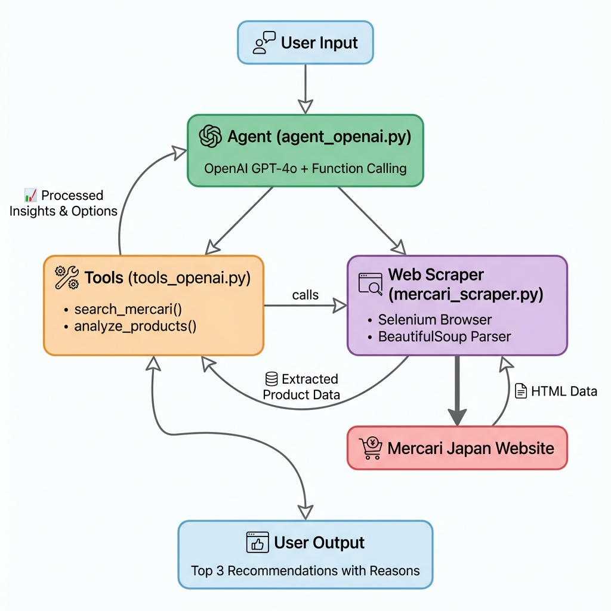

# Mercari Japan AI Shopping Agent

An intelligent AI agent that helps users find and purchase products on Mercari Japan by understanding natural language requests, performing smart searches, and providing reasoned recommendations.

## Overview

This AI shopping agent uses OpenAI's GPT-4o with function calling to:

1. **Understand User Requests**: Parse natural language queries to extract product requirements, price ranges, and preferences
2. **Smart Search**: Execute targeted searches on Mercari Japan with appropriate filters and keywords
3. **Data Extraction**: Scrape product information including names, prices, conditions, and URLs
4. **Intelligent Recommendations**: Analyze results and recommend the top 3 products with clear, reasoned explanations
5. **Interactive Experience**: Engage in conversational interaction with follow-up questions and clarifications

### Architecture



The agent follows a clean, modular architecture with clear separation of concerns:

**Flow:**
1. **User Input** → Natural language query (e.g., "Find Pokemon toys under 2000 yen")
2. **Agent** → Interprets request using GPT-4o and decides which tools to use
3. **Tools** → Executes `search_mercari()` and `analyze_products()` functions
4. **Web Scraper** → Uses Selenium to fetch real-time data from Mercari Japan
5. **Analysis** → Scores products based on price, condition, and value
6. **User Output** → Returns top 3 recommendations with clear reasons

**Components:**

- **`agent_openai.py`**: Main orchestration layer using OpenAI's function calling API
- **`tools_openai.py`**: Tool definitions (`search_mercari`, `analyze_products`) and execution logic
- **`mercari_scraper.py`**: Selenium-based web scraper with anti-bot measures

### LLM Selection

After evaluating both OpenAI and Anthropic Claude APIs, I chose **OpenAI's GPT-4o** for this implementation due to:

- **Free Testing via GitHub Models**: No credit card required to test with GPT-4o
- **Excellent Function-Calling Capabilities**: Robust and well-documented tool-use API
- **Ease of Setup**: Simple for evaluators to test the agent
- **Strong Performance**: Great at understanding Japanese product names and user intent

## Setup Instructions

### Prerequisites

- Python 3.10 or later
- API Key (choose one):
  - **GitHub Token** (FREE, recommended) - Get from https://github.com/settings/tokens
  - **OpenAI API Key** - Get from https://platform.openai.com/api-keys

### Installation

1. **Clone or extract the project**:
```bash
cd mercari-ai-agent
```

2. **Create a virtual environment** (recommended):
```bash
python -m venv venv

# On Windows:
venv\\Scripts\\activate

# On macOS/Linux:
source venv/bin/activate
```

3. **Install dependencies**:
```bash
pip install -r requirements.txt
```

4. **Set up your API key**:

**For GitHub Models (FREE, Recommended):**
```bash
# Get token from: https://github.com/settings/tokens
# On Windows (PowerShell):
$env:GITHUB_TOKEN="github_pat_your-token-here"

# On macOS/Linux:
export GITHUB_TOKEN="github_pat_your-token-here"
```

**For OpenAI:**
```bash
# On Windows (PowerShell):
$env:OPENAI_API_KEY="sk-your-key-here"

# On macOS/Linux:
export OPENAI_API_KEY="sk-your-key-here"
```

**Detailed setup guide**: See `GITHUB_MODELS_SETUP.md` for GitHub Models setup

## Usage Instructions

### Interactive Mode

Run the agent:
```bash
python agent_openai.py
```

Example interaction:
```
You: I'm looking for a Nintendo Switch in good condition under 30000 yen

[Agent is thinking...]

Agent: I'll help you find a Nintendo Switch under ¥30,000. Let me search Mercari Japan for you.

[Agent uses search_mercari tool]
[Agent uses analyze_products tool]

Here are my top 3 recommendations:

1. **[Nintendo Switch 本体 グレー](https://jp.mercari.com/item/m12345678)**
   - **Price:** ¥24,800
   - **Condition:** 目立った傷や汚れなし
   - **Why recommended:**
     - Great value - below average price
     - Good condition
     - Complete product information available

2. **[Nintendo Switch Lite](https://jp.mercari.com/item/m87654321)**
   - **Price:** ¥18,500
   - **Condition:** 新品、未使用
   - **Why recommended:**
     - Excellent condition (new)
     - Affordable price at ¥18,500
     - Complete product information available

...

Would you like to refine your search? I can help you look for specific colors, bundle options, or adjust the price range!
```

### Programmatic Usage

You can also use the agent programmatically in your Python code:

```python
from agent_openai import MercariAgentOpenAI

# Initialize the agent
agent = MercariAgentOpenAI(
    api_key="your-github-token",  # or OPENAI_API_KEY
    base_url="https://models.inference.ai.azure.com",  # For GitHub Models
    model="gpt-4o"
)

# Send a request
response = agent.chat("Find me a M

acBook Pro under 100000 yen")
print(response)

# Continue the conversation
response = agent.chat("Show me only the ones in excellent condition")
print(response)

# Reset conversation
agent.reset_conversation()
```

### Advanced Usage

You can customize the scraper behavior by modifying `mercari_scraper.py`:

```python
from mercari_scraper import MercariScraper

# Custom scraper with longer delay
scraper = MercariScraper(delay=3.0, headless=False)

# Direct search
products = scraper.search_products(
    keyword="iPhone 14",
    max_results=30,
    min_price=50000,
    max_price=100000,
    sort="price_asc"
)
```

## Design Choices

### 1. Tool-Calling Architecture

- **Why**: The assignment requires implementing an agent with tool-calling mechanisms. This approach allows the LLM to decide when and how to use tools dynamically.
- **Implementation**: Using OpenAI's native function calling API, the agent can invoke `search_mercari` and `analyze_products` tools as needed.
- **Benefit**: More flexible than hardcoded workflows; the agent adapts to different user queries.

### 2. OpenAI GPT-4o

- **Why**: Balance of performance, accessibility, and cost-effectiveness
- **Benefits**: 
  - Excellent reasoning capabilities for product analysis
  - Strong function-calling performance
  - Free testing via GitHub Models
  - Well-documented API

### 3. Selenium + BeautifulSoup for Web Scraping

- **Why**: Mercari Japan uses dynamic JavaScript rendering which requires browser automation
- **Implementation**: Selenium for initial page load, BeautifulSoup for parsing
- **Trade-off**: Slightly slower than pure requests, but much more reliable for JavaScript-heavy sites
- **Features**:
  - Anti-bot detection measures
  - Stealth mode options
  - Headless operation for efficiency

### 4. Modular Architecture

- **Separation of concerns**: Scraping, tool definitions, and agent logic are separated
- **Benefits**: 
  - Easier to test individual components
  - Simpler to maintain and update
  - Can swap out scraping implementation without affecting agent logic

### 5. Intelligent Product Analysis

- **Multi-criteria scoring**: Products are scored based on:
  - **Price**: Relative to average price of results
  - **Condition**: Japanese condition labels (新品, 未使用, etc.)
  - **Completeness**: Whether all product information is available
- **Flexible priorities**: Users can prioritize different aspects:
  - `price`: Cheapest items first
  - `condition`: Best condition items first
  - `balanced`: Best overall value (default)
- **Reasoning**: Each recommendation includes specific reasons explaining the choice

### 6. Conversation Management

- **Stateful conversations**: The agent maintains context across multiple turns
- **Reset capability**: Users can start fresh without restarting the program
- **Benefits**: More natural interaction; users can refine searches and ask follow-ups

## Potential Improvements

### Short-term Enhancements

1. **Enhanced Scraping**:
   - Extract seller ratings and seller information
   - Add retry logic with exponential backoff
   - Cache results to reduce redundant requests
   - Extract product descriptions and images

2. **Better Search Intelligence**:
   - Automatic Japanese translation for English queries
   - Implement synonym expansion (e.g., "laptop" → "ノートPC", "MacBook")
   - Category-based filtering (electronics, fashion, etc.)
   - Brand recognition and filtering

3. **Advanced Analysis**:
   - Price history tracking to identify good deals
   - Seller reputation scoring
   - Similar product comparison
   - Estimated value assessment using historical data

4. **User Experience**:
   - Add image display in recommendations
   - Generate comparison tables
   - Save favorite searches
   - Alert users when new matching items appear

### Long-term Enhancements

1. **Multi-platform Support**:
   - Extend to other Japanese marketplaces (Rakuma, Yahoo Auctions)
   - Price comparison across platforms
   - Unified recommendation engine

2. **Personalization**:
   - Learn user preferences over time
   - Build user profiles for recurring searches
   - Personalized ranking algorithms

3. **Advanced Features**:
   - Automated bidding for auction items
   - Price drop notifications
   - Purchase automation (with user approval)
   - Integration with translation APIs for international users

4. **Robustness**:
   - Rate limiting and request throttling
   - Proxy rotation for large-scale scraping
   - Error recovery and graceful degradation
   - Comprehensive logging and monitoring

5. **Testing & Quality**:
   - Unit tests for all components
   - Integration tests with mock Mercari responses
   - Performance benchmarking
   - A/B testing for recommendation algorithms

## Technical Notes

### Rate Limiting

The scraper includes a configurable delay (default 2 seconds) between requests to be respectful to Mercari's servers. Adjust this in `MercariScraper(delay=X)` if needed.

### Error Handling

- The agent gracefully handles API errors, scraping failures, and malformed data
- Failed tool calls are reported back to the LLM for adaptive handling
- Network timeouts are configured appropriately

### Token Usage

- Conversation history is maintained for context
- Long conversations may exceed token limits; consider implementing conversation pruning
- Current implementation uses function calling for efficient tool use

## Troubleshooting

### "API key must be provided" error
- Ensure your `OPENAI_API_KEY` or `GITHUB_TOKEN` environment variable is set correctly
- Check that there are no extra spaces or quotes in the key

### No products found
- Mercari's HTML structure may have changed; check `mercari_scraper.py`
- Try different search keywords (Japanese keywords often work better)
- Check your internet connection

### Slow performance
- Increase the scraper delay if getting rate-limited
- Reduce `max_results` in searches
- Make sure Chrome/ChromeDriver is installed correctly

### ChromeDriver issues
- The scraper uses `webdriver-manager` to automatically download ChromeDriver
- Ensure Chrome browser is installed on your system
- Check firewall settings if download fails

## License

This project is created for the Mercari Japan AI Shopper Challenge.

## Acknowledgments

- Built using OpenAI's GPT-4o via GitHub Models
- Web scraping with Selenium and BeautifulSoup4
- Mercari Japan for product data
